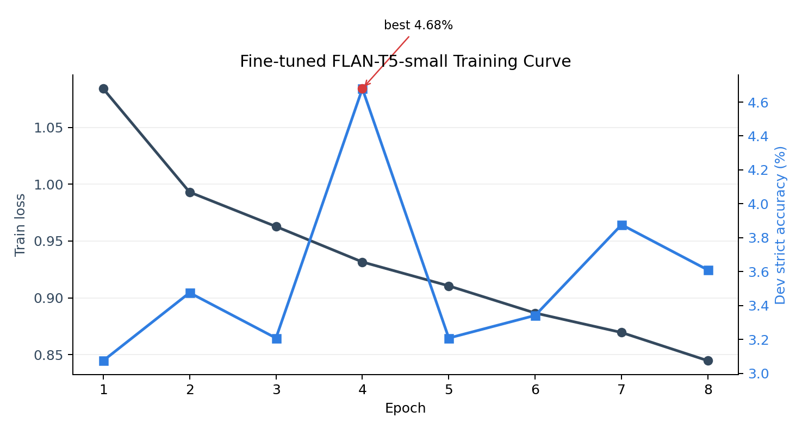
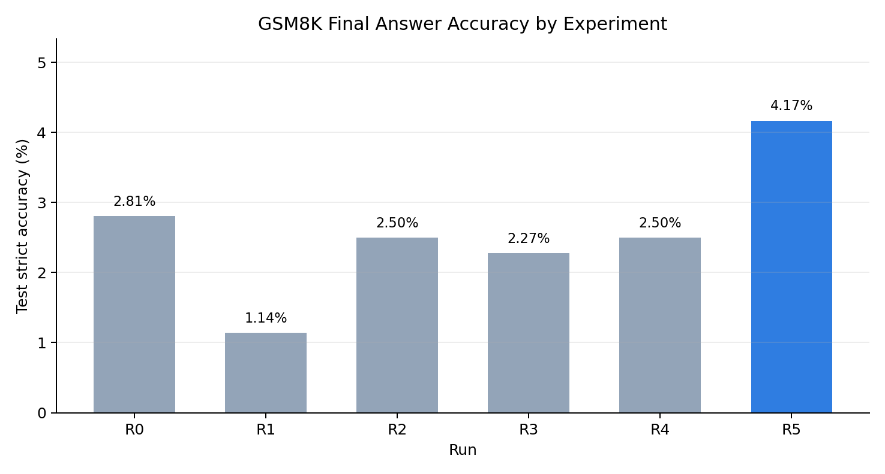

# 基于 RNN Seq2Seq 与 Bahdanau Attention 的 GSM8K 数学推理实验报告

## 1. 任务介绍

本实验使用 GSM8K 数据集完成英文小学数学应用题的文本生成任务。输入为题目文本，输出为包含推理过程和最终答案的答案文本。主要实验使用 `socratic` 配置，其答案格式包含分步问答和最终答案标记：

```text
How many clips did Natalia sell in May? ** ...
#### 72
```

本实验重点是完整实现传统 RNN Encoder-Decoder 建模流程，包括数据划分、分词、GRU 编码器/解码器、Bahdanau Attention、teacher forcing、greedy/beam 解码、最终答案抽取、实验对照和错误分析。由于 GSM8K 需要多步语义理解和算术推理，小型 RNN 从零训练的准确率预期不会很高。

为让结果更完整，报告最后加入一个预训练增强对照：使用 `google/flan-t5-small` 微调 final-only 目标。该实验不替代 RNN 主实验，只作为“如果使用预训练知识，最终答案准确率能提升到什么程度”的补充参考。

## 2. 数据集与划分

数据集使用 Hugging Face `openai/gsm8k`。`socratic` 和 `main` 配置均使用相同划分方式：官方 train 按随机种子 42 划分为 90% train 和 10% dev，官方 test 只用于最终测试。

| split | 样本数 |
|---|---:|
| train | 6725 |
| dev | 748 |
| test | 1319 |

### Socratic 完整答案数据统计

| split | 平均输入长度 | 平均目标长度 | p95 输入长度 | p95 目标长度 | 最大输入长度 | 最大目标长度 | 截断率 |
|---|---:|---:|---:|---:|---:|---:|---:|
| train | 54.87 | 158.64 | 94 | 290 | 206 | 558 | 0.0000 |
| dev | 55.70 | 157.72 | 96 | 287 | 152 | 456 | 0.0000 |
| test | 56.39 | 162.07 | 96 | 287 | 184 | 516 | 0.0000 |

### Final-only 数据统计

final-only 实验只把目标设为 `#### answer`，用于验证模型是否能直接学习最终答案。

| split | 平均输入长度 | 平均目标长度 | p95 目标长度 | 最大目标长度 | 截断率 |
|---|---:|---:|---:|---:|---:|
| train | 54.87 | 5.31 | 7 | 12 | 0.0000 |
| dev | 55.70 | 5.27 | 7 | 9 | 0.0000 |
| test | 56.39 | 5.28 | 7 | 10 | 0.0000 |

### Main 配置数据统计

`main` 配置的目标答案比 `socratic` 更短。为避免显存不稳定，R4 中 `max_tgt_len` 设为 384，因此存在极少量截断。

| split | 平均输入长度 | 平均目标长度 | p95 目标长度 | 最大目标长度 | 截断率 |
|---|---:|---:|---:|---:|---:|
| train | 54.87 | 117.84 | 220 | 447 | 0.0004 |
| dev | 55.70 | 116.65 | 220 | 367 | 0.0000 |
| test | 56.39 | 120.16 | 213 | 419 | 0.0015 |

## 3. 分词与答案抽取

实验采用正则分词：

```text
####|<<|>>|<nl>|[A-Za-z]+|\d|[+\-*/=.,!?;:()$%]|\S
```

处理原则：

1. 英文转小写。
2. 数字按单个 digit 切分，减少未登录数字问题。
3. `####`、`<<`、`>>` 和换行标记 `<nl>` 单独保留。
4. 词表只用训练集构建。

评价时从生成文本中抽取最终答案：

1. strict：必须匹配 `#### 数字`。
2. fallback：如果没有 `####`，取生成文本最后一个数字。

报告中以 strict final answer accuracy 为主。

## 4. 模型结构

主模型为 GRU Seq2Seq：

```text
Question tokens
-> Embedding
-> 2-layer BiGRU Encoder
-> Bahdanau Attention
-> 2-layer GRU Decoder
-> Linear projection
-> Answer tokens
```

主要超参数：

| 参数 | 取值 |
|---|---:|
| embedding_dim | 256 |
| encoder | 2-layer BiGRU |
| encoder_hidden | 256 each direction |
| decoder | 2-layer GRU |
| decoder_hidden | 512 |
| dropout | 0.3 |
| optimizer | AdamW |
| learning_rate | 0.001 |
| grad_clip | 1.0 |
| AMP | 开启 |

训练使用 teacher forcing，并从 1.0 线性衰减到 0.5。除 R0 外，完整答案实验使用 greedy 解码时最大生成长度为 256。

### 预训练增强对照

R5 使用 `google/flan-t5-small`，输入为题目文本，输出为 `#### answer`。微调时默认关闭 AMP，避免小模型在本地环境中出现半精度 `NaN`；生成阶段使用 `num_beams=4`，最大生成长度为 16。

## 5. 实验设置

实验环境为 Windows + RTX 4060 Laptop GPU 8GB，使用 `vision_lab` conda 环境，Python 3.10.19，PyTorch 2.4.1，CUDA 可用。

完成的实验组如下：

| Run | 数据配置 | 目标形式 | 模型 | 解码 | 目的 |
|---|---|---|---|---|---|
| R0 | socratic | final-only | GRU Seq2Seq + Attention | greedy | 验证直接生成最终答案的上限 |
| R1 | socratic | full socratic | GRU Seq2Seq, no attention | greedy | 注意力消融 |
| R2 | socratic | full socratic | GRU Seq2Seq + Attention | greedy | 主模型 |
| R3 | socratic | full socratic | R2 checkpoint | beam=5 | 解码策略消融 |
| R4 | main | full main | GRU Seq2Seq + Attention | greedy | 比较 main 与 socratic |
| R5 | socratic | final-only | FLAN-T5-small 微调 | beam=4 | 预训练增强对照 |

训练中 R4 在默认 batch 下出现 CUDA/cuDNN 不稳定，因此最终将 microbatch 降为 4、梯度累积设为 8，并关闭 cuDNN benchmark 后完成训练。

R5 第一次尝试使用半精度训练时出现 `NaN` loss，因此正式实验改为 FP32 微调。该处理提高了训练稳定性，最终格式率保持为 1.0。

## 6. 训练日志摘要

### R0 final-only

| epoch | train loss | dev loss | dev strict acc | format rate | GPU peak GB |
|---:|---:|---:|---:|---:|---:|
| 1 | 1.776798 | 1.368395 | 0.016043 | 1.000000 | 0.693 |
| 2 | 1.419205 | 1.331232 | 0.026738 | 1.000000 | 0.695 |
| 3 | 1.386484 | 1.401288 | 0.022727 | 1.000000 | 0.700 |
| 4 | 1.371329 | 1.375793 | 0.022727 | 1.000000 | 0.700 |
| 5 | 1.340933 | 1.383731 | 0.017380 | 1.000000 | 0.700 |

R0 在 epoch 5 早停，最佳 checkpoint 为 epoch 2。

### R1 no-attention

| epoch | train loss | dev loss | dev strict acc | format rate | GPU peak GB |
|---:|---:|---:|---:|---:|---:|
| 1 | 3.770502 | 3.008644 | 0.000000 | 0.000000 | 4.515 |
| 2 | 3.128977 | 2.674464 | 0.001337 | 0.124332 | 4.515 |
| 3 | 3.098982 | 2.555912 | 0.012032 | 0.766043 | 4.515 |
| 4 | 3.271735 | 2.578797 | 0.002674 | 0.127005 | 4.519 |

R1 最佳 checkpoint 为 epoch 3。

### R2 attention-socratic

| epoch | train loss | dev loss | dev strict acc | format rate | GPU peak GB |
|---:|---:|---:|---:|---:|---:|
| 1 | 3.608227 | 2.771432 | 0.004011 | 0.247326 | 6.647 |
| 2 | 2.794369 | 2.366018 | 0.009358 | 0.905080 | 6.647 |
| 3 | 2.633270 | 2.280910 | 0.008021 | 0.653743 | 6.749 |
| 4 | 2.721730 | 2.304979 | 0.005348 | 0.864973 | 6.749 |

R2 最佳 checkpoint 为 epoch 2。训练日志中的 epoch 2 dev strict acc 为 0.009358；后续修正 digit-level detokenization 后，使用同一 `best.pt` 重新评估 dev 得到 0.012032，最终结果表采用重新评估后的指标。

### R4 attention-main

| epoch | train loss | dev loss | dev strict acc | format rate | GPU peak GB |
|---:|---:|---:|---:|---:|---:|
| 1 | 3.622772 | 2.921060 | 0.012032 | 0.340909 | 3.374 |
| 2 | 2.949968 | 2.607208 | 0.014706 | 0.622995 | 3.479 |
| 3 | 2.891498 | 2.425602 | 0.014706 | 0.875668 | 3.497 |
| 4 | 2.970923 | 2.452139 | 0.014706 | 0.903743 | 3.497 |

R4 最佳 checkpoint 为 epoch 3。

### R5 FLAN-T5-small final-only

| epoch | train loss | dev strict acc | dev fallback acc | format rate |
|---:|---:|---:|---:|---:|
| 1 | 1.084081 | 0.030749 | 0.030749 | 1.000000 |
| 2 | 0.993052 | 0.034759 | 0.034759 | 1.000000 |
| 3 | 0.962800 | 0.032086 | 0.032086 | 1.000000 |
| 4 | 0.931590 | 0.046791 | 0.046791 | 1.000000 |
| 5 | 0.910567 | 0.032086 | 0.032086 | 1.000000 |
| 6 | 0.886665 | 0.033422 | 0.033422 | 1.000000 |
| 7 | 0.869535 | 0.038770 | 0.038770 | 1.000000 |
| 8 | 0.844696 | 0.036096 | 0.036096 | 1.000000 |

R5 最佳 checkpoint 为 epoch 4。训练曲线如下：



## 7. 最终结果

| Run | 数据配置 | 目标形式 | 模型/attention | decoding | best epoch | dev strict acc | test strict acc | test fallback acc | test format rate |
|---|---|---|---|---|---:|---:|---:|---:|---:|
| R0 | socratic | final-only | 是 | greedy | 2 | 0.026738 | 0.028052 | 0.028052 | 1.000000 |
| R1 | socratic | full socratic | 否 | greedy | 3 | 0.012032 | 0.011372 | 0.012130 | 0.746020 |
| R2 | socratic | full socratic | 是 | greedy | 2 | 0.012032 | 0.025019 | 0.025777 | 0.903715 |
| R3 | socratic | full socratic | 是 | beam=5 | 2 | 0.009358 | 0.022745 | 0.022745 | 0.959818 |
| R4 | main | full main | 是 | greedy | 3 | 0.014706 | 0.025019 | 0.025777 | 0.855951 |
| R5 | socratic | final-only | FLAN-T5-small | beam=4 | 4 | 0.046791 | 0.041698 | 0.041698 | 1.000000 |



结果表保存在：

```text
gsm8k_rnn_attention/runs/result_summary.csv
```

主要观察：

1. R5 取得最高测试集 strict accuracy，为 0.041698；相比 RNN final-only 基线 R0 的 0.028052，相对提升约 48.6%。
2. 在只比较从零训练的 RNN 实验时，R0 的最终答案准确率最高，说明把任务简化为只生成 `#### answer` 确实更容易。
3. R2 明显优于 R1，说明 attention 对完整 socratic 文本生成有帮助，尤其提高了 `####` 格式生成率。
4. R3 beam=5 的格式率更高，但最终答案准确率低于 greedy，说明 beam search 更偏向高概率模板文本，不一定带来更正确的数字推理。
5. R4 main 与 R2 test strict accuracy 相同，但格式率较低，说明更短的 main 答案并没有显著改善最终答案准确率。

## 8. 错误分析

以 R2 主模型 greedy 测试集为例，错误统计如下：

| 类型 | 数量 | 占比 |
|---|---:|---:|
| correct | 33 | 0.0250 |
| missing_final_marker | 127 | 0.0963 |
| wrong_final_number | 1159 | 0.8787 |

R0、R1、R4、R5 的测试集错误统计：

| Run | correct | missing_final_marker | wrong_final_number |
|---|---:|---:|---:|
| R0 | 37 | 0 | 1282 |
| R1 | 15 | 335 | 969 |
| R4 | 33 | 190 | 1096 |
| R5 | 55 | 0 | 1264 |

典型错误：

1. 最终数字错误。模型常能生成 `####`，但数字不对，例如标准答案为 18 时输出 `#### 120`。
2. 重复循环。部分样本会不断重复 “the number of the number...” 等模板片段，无法及时生成 `<eos>` 或 `####`。
3. 表面格式学习强于推理能力。模型学到了 `How many... ** ... <<...>> ... ####` 的表面结构，但没有可靠掌握题目中的数量关系和多步算术。
4. R5 的格式率为 1.0，说明预训练模型更容易稳定输出 `####` 格式；但绝大多数错误仍是最终数字错误，说明 final-only 微调只能提升答案分布和语言先验，不能完全解决多步计算。

## 9. 结论

本实验完成了 GSM8K 上 RNN Seq2Seq 系列实验，包括 final-only 基线、no-attention 消融、attention 主模型、beam search 解码对照和 main 配置对照。同时加入 FLAN-T5-small final-only 微调作为增强对照。

从结果看，attention 能提升完整答案生成的格式稳定性和最终答案准确率；在从零训练的 RNN 中，final-only 任务最容易，测试集 strict accuracy 为 2.81%。加入预训练增强后，R5 的测试集 strict accuracy 提升到 4.17%，是全实验最佳结果。整体上，小型 RNN 从零训练可以学到部分语言模板和数字分布，但很难真正完成 GSM8K 所需的多步数学推理；预训练模型能改善格式和答案先验，但仍无法在小规模微调下可靠完成复杂计算。

后续改进可以考虑：

1. 加入 copy mechanism，改善题目数字复制。
2. 使用显式表达式解析或外部计算器。
3. 在预训练模型中加入显式计算器或程序执行模块。
4. 将训练目标拆为“推理步骤生成”和“最终答案预测”两个阶段。

## 10. 交付文件

主要交付内容：

```text
第一次/大作业第一次.md
第一次/report.md
第一次/gsm8k_rnn_attention/configs/
第一次/gsm8k_rnn_attention/src/
第一次/gsm8k_rnn_attention/data/
第一次/gsm8k_rnn_attention/data_final_only/
第一次/gsm8k_rnn_attention/data_main/
第一次/gsm8k_rnn_attention/runs/final_only_socratic_4060/
第一次/gsm8k_rnn_attention/runs/no_attn_socratic_4060/
第一次/gsm8k_rnn_attention/runs/attn_socratic_4060/
第一次/gsm8k_rnn_attention/runs/attn_main_4060/
第一次/gsm8k_rnn_attention/runs/flan_t5_small_finetuned_final_fp32/
第一次/gsm8k_rnn_attention/runs/result_summary.csv
第一次/gsm8k_rnn_attention/runs/accuracy_comparison.png
```

R0-R4 的 RNN run 目录中包含：

```text
best.pt
last.pt
train_log.csv
dev_predictions.jsonl
test_predictions.jsonl
summary.json
curves.png
error_analysis.csv
error_examples.jsonl
```

R3 beam=5 的预测文件保存在：

```text
第一次/gsm8k_rnn_attention/runs/attn_socratic_4060/dev_predictions_beam5.jsonl
第一次/gsm8k_rnn_attention/runs/attn_socratic_4060/test_predictions_beam5.jsonl
```

R5 预训练增强对照的模型和预测文件保存在：

```text
第一次/gsm8k_rnn_attention/runs/flan_t5_small_finetuned_final_fp32/best_model/
第一次/gsm8k_rnn_attention/runs/flan_t5_small_finetuned_final_fp32/dev_predictions.jsonl
第一次/gsm8k_rnn_attention/runs/flan_t5_small_finetuned_final_fp32/test_predictions.jsonl
第一次/gsm8k_rnn_attention/runs/flan_t5_small_finetuned_final_fp32/curves.png
```
