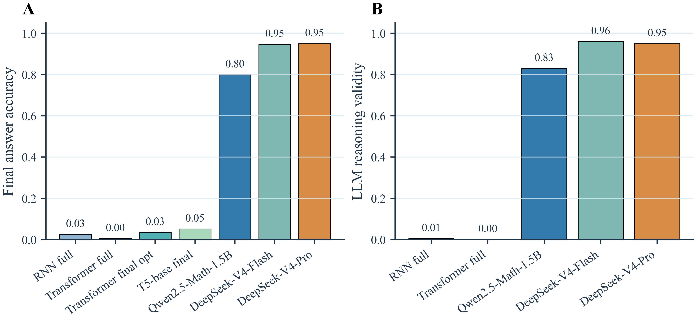
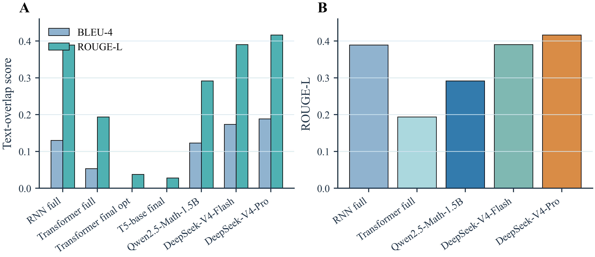
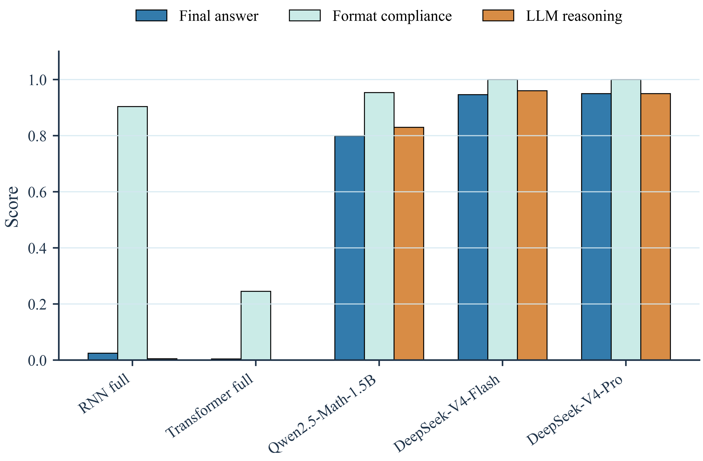
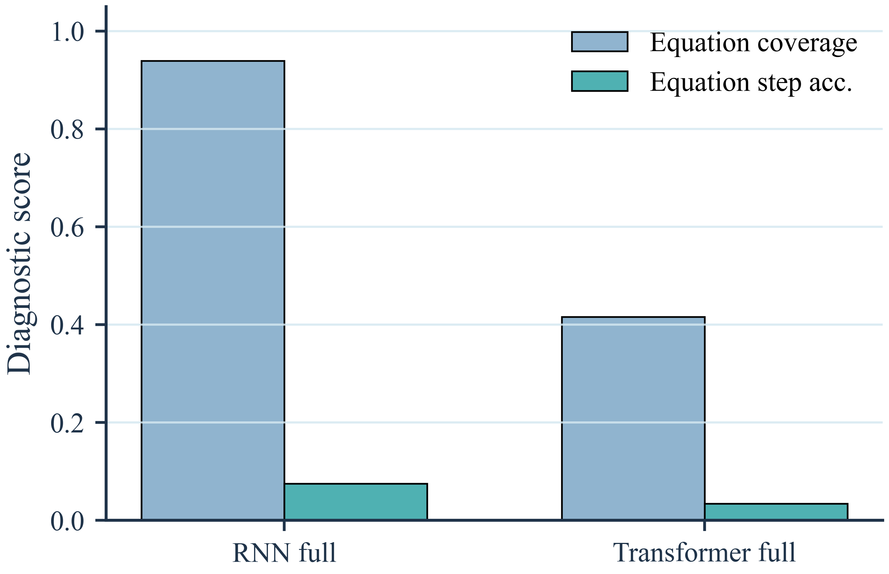
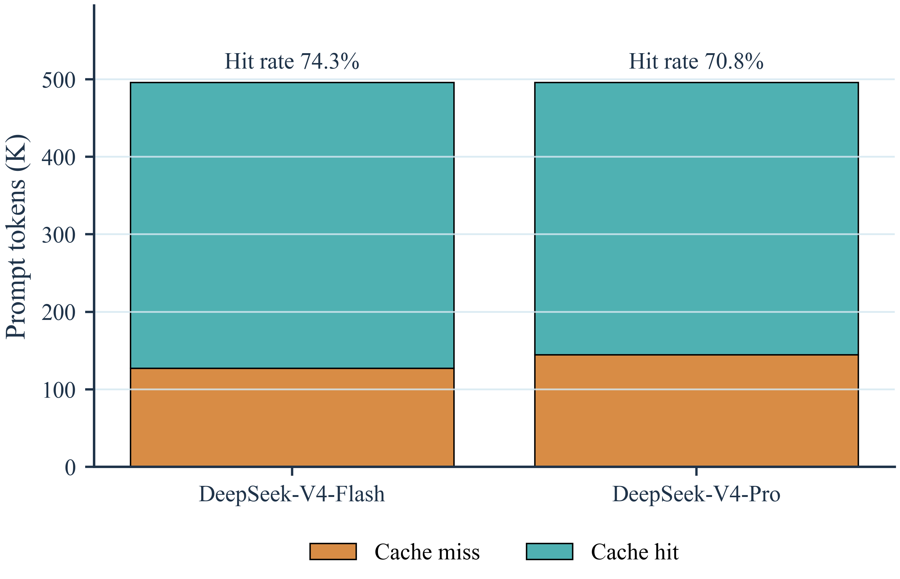

# 谁更会算数学题？GSM8K 上 Seq2Seq、Transformer 与大模型的对比实验

## 1. 任务与数据

一道数学应用题，模型要过三关：读题、找关系、算对数。和普通文本生成不同，语言再流畅，最后数字错了就全错。

我们在 GSM8K 上比较五条路线：RNN Seq2Seq、自实现 Transformer、预训练 T5、本地 Qwen2.5-Math-1.5B，以及 DeepSeek-V4-Flash/Pro API。所有模型使用同一份数据划分：

| split | 样本数 |
|---|---:|
| train | 6725 |
| dev | 748 |
| test | 1319 |

输出格式统一要求为 `#### number`。没有这一行，自动评测就很难稳定抽取最终答案。

## 2. 实验方法

| 方法类别 | 实验设置 |
|---|---|
| RNN Seq2Seq | 2-layer BiGRU Encoder + Bahdanau Attention + 2-layer GRU Decoder；同时测试 full-answer 和 final-only |
| Transformer | 从零实现 encoder-decoder Transformer，并对 final-only 版本做两轮调参 |
| 预训练 T5 | FLAN-T5-small/base final-only 微调；T5-base 使用 Adafactor 和 gradient checkpointing 控制显存 |
| 本地开源大模型 | Qwen2.5-Math-1.5B-Instruct，fp16 + few-shot CoT + batch=4 |
| DeepSeek API | DeepSeek-V4-Flash 和 DeepSeek-V4-Pro，固定 prompt 前缀 + warm-up + 20 workers |

FLAN-T5-small 的测试集最终答案准确率为 0.041698，低于 T5-base 的 0.051554，因此主表只保留 T5-base。Qwen 的格式合规率为 0.953753，未达到 1.0，主要原因是 54 条样本缺少明确最终答案标记，另有 7 条 strict 解析失败但 fallback 能抽取答案。DeepSeek-V4-Flash 的 prompt cache hit rate 为 0.743287，DeepSeek-V4-Pro 为 0.707959。

## 3. 评价指标

BLEU 和 ROUGE 看的是文本重合度，不等于会算题。一个模型可以学会参考答案的写法，却把数字算错；另一个模型也可能用不同表述讲对题，反而被 BLEU 扣分。所以它们只作为辅助参考。

真正和数学问答直接相关的是三个指标：

| 指标 | 含义 |
|---|---|
| Final Answer Accuracy | 抽取 `#### number` 后与标准答案做数值归一化比较 |
| Answer Format Compliance | 判断输出中是否有可解析的最终答案行 |
| LLM Reasoning Validity | 随机抽取 100 条测试样本，让 DeepSeek-V4-Pro 按 0/1/2 分评价推理过程，并归一化到 0-1 |

Equation Execution Accuracy 只作为补充诊断，用来检查 full-answer 模型是在真计算，还是只模仿了 `<<表达式=结果>>` 的格式。

## 4. 主结果

| 模型 | 类别 | BLEU-4 | ROUGE-L | Final Answer Acc | Format Rate |
|---|---|---:|---:|---:|---:|
| RNN full | RNN | 0.129968 | 0.389191 | 0.025019 | 0.903715 |
| Transformer full | Transformer | 0.053301 | 0.193792 | 0.004549 | 0.245641 |
| Transformer final opt | Transformer optimized | 0.000000 | 0.037787 | 0.034875 | 1.000000 |
| Pretrained T5-base final | Pretrained Transformer | 0.000000 | 0.027939 | 0.051554 | 1.000000 |
| Local Qwen2.5-Math-1.5B CoT | Local open LLM | 0.122963 | 0.291846 | 0.799090 | 0.953753 |
| DeepSeek-V4-Flash API | Hosted LLM | 0.173545 | 0.390629 | 0.946171 | 1.000000 |
| DeepSeek-V4-Pro API | Hosted LLM | 0.188433 | 0.416396 | 0.949962 | 1.000000 |



结果的差距很大。DeepSeek-V4-Pro 准确率 0.950，Flash 为 0.946，大约每 20 道题错 1 道。本地 Qwen2.5-Math-1.5B 准确率 0.799，约等于每 5 道题答对 4 道，而且不依赖网络。

从零训练的小模型基本没有真正学会多步算术。调参后的 Transformer final opt 是自实现模型中最好的，准确率也只有 0.035；RNN full 为 0.025。



BLEU 和 ROUGE 的结果很有代表性：Qwen2.5-Math-1.5B 的 BLEU-4 为 0.122963，略低于 RNN full 的 0.129968，但最终答案准确率远高于 RNN full。T5-base final 的 BLEU-4 为 0，准确率却高于 Transformer full。这说明文本重合指标不适合单独判断数学能力。

## 5. 任务相关指标与 LLM 复核

| 模型 | Final Answer Acc | Format Compliance | LLM Reasoning Validity |
|---|---:|---:|---:|
| RNN full | 0.025019 | 0.903715 | 0.005 |
| Transformer full | 0.004549 | 0.245641 | 0.000 |
| Local Qwen2.5-Math-1.5B | 0.799090 | 0.953753 | 0.830 |
| DeepSeek-V4-Flash | 0.946171 | 1.000000 | 0.960 |
| DeepSeek-V4-Pro | 0.949962 | 1.000000 | 0.950 |



100 条随机样本的 LLM 复核结果：

| 模型 | 样本数 | 平均分 | 推理有效率 | 2分比例 | 0分比例 |
|---|---:|---:|---:|---:|---:|
| RNN full | 100 | 0.01 | 0.005 | 0.00 | 0.99 |
| Transformer full | 100 | 0.00 | 0.000 | 0.00 | 1.00 |
| Local Qwen2.5-Math-1.5B | 100 | 1.66 | 0.830 | 0.74 | 0.08 |
| DeepSeek-V4-Flash | 100 | 1.92 | 0.960 | 0.95 | 0.03 |
| DeepSeek-V4-Pro | 100 | 1.90 | 0.950 | 0.94 | 0.04 |

LLM 复核很方便，但不能当成人工标注的完全替代。DeepSeek-V4-Pro 同时也是被评测模型之一，可能带来同源模型偏差；100 条样本能看趋势，但覆盖不了所有细粒度错误。

## 6. 错误分析

RNN full 和 Transformer full 都失败，但失败方式不同。RNN full 经常生成公式标记，格式也不算差；问题是算不对。Transformer full 更靠前一步就掉下去了，很多输出里根本找不到 `####`。

| 题目简述 | 标准答案 | 模型输出片段 | 错误类型 |
|---|---:|---|---|
| 鸭蛋每日收入题 | `#### 18` | RNN full 输出 `<<12*12=12>>`、`<<12*12=120>>`，最后给出 `#### 120` | 公式格式像，但计算错 |
| 房屋翻修利润题 | `#### 70000` | Transformer full 反复生成 “the price of the price”，没有输出 `####` 最终答案行 | 格式不可解析 |
| 自行车打气收费题 | `#### 5` | Qwen 推理到 500 cents = 5 dollars，但结尾停在 `\boxed` 附近，strict 解析不到最终答案 | 推理接近正确，但格式截断 |



RNN full 的 Equation Coverage 为 0.939348，但 Equation Step Accuracy 只有 0.074517。格式像，并不代表计算对。final-only 模型把格式问题解决了，准确率却没有本质提升，这说明瓶颈在内部推理能力。



Qwen2.5-Math-1.5B 的优势是本地可复现；DeepSeek 系列则在准确率上明显更强。Flash 和 Pro 只差约 5 道题，如果任务对成本敏感，Flash 更合适；如果追求最高精度，Pro 更稳妥。

## 7. Prompt 模板

```text
You are a precise GSM8K math solver.
Show concise step-by-step arithmetic.
The final line must be exactly: #### number

Example:
Question: A store has 12 pencils. It buys 8 more pencils and then sells 5.
Answer:
The store has 12 + 8 = 20 pencils after buying more.
After selling 5, it has 20 - 5 = 15 pencils left.
#### 15

Now solve:
Question: {question}
Answer:
```

## 8. 结论

同一批 GSM8K 测试题，把模型差距拉得很开。

- **模型规模和预训练几乎决定上限。** 从零训练的小模型准确率低于 0.04；1.5B 的数学专项模型达到 0.799；DeepSeek-V4-Pro 和 Flash 接近 0.95。
- **BLEU/ROUGE 会误导数学问答评测。** RNN full 的 BLEU-4 略高于 Qwen，但最终答案准确率相差 30 倍以上。
- **本地部署和云端 API 各有位置。** Qwen2.5-Math-1.5B 可以离线复现；DeepSeek-Flash 以较低成本接近 Pro；DeepSeek-Pro 是这组实验里的最高精度方案。

实验仍有局限：没有对 Qwen 做微调；没有系统比较不同 prompt 结构对缓存命中率的影响；LLM 评委是否与人工评委一致，也需要进一步验证。后续可以加入 SVAMP、MultiArith 等数据集，并对 prompt 数量、温度和评委模型做消融实验。
